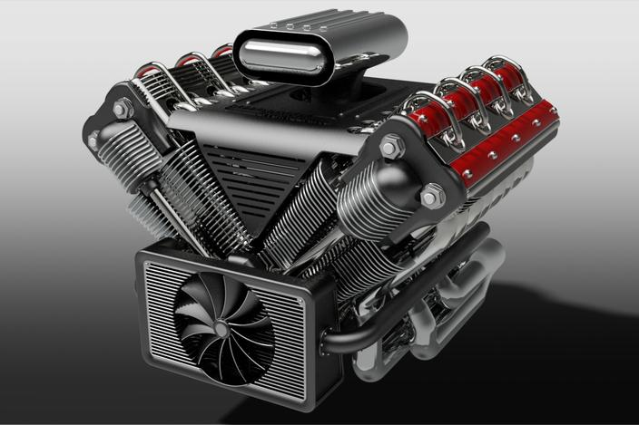

title: JavaScript and JIT Compilation
output: JavaScript-and-JIT-Comilation.html

---

# JS and JIT

## TEAM #14

## B10315002 黃昱豪
## B10315005 林昆立
## B10315024 朱伯軒

---

### 目錄

- JavaScript 的歷史
- JavaScript 簡介與特性
- V8 Engine
- JIT Compilation
- JavaScript 在網頁上的應用

---

### JavaScript 的歷史

1995 年，由 *Netscape* 公司發明（*Netscape* 是一套非常古老的瀏覽器），
為了能夠在瀏覽器上推動 Java Applet，需要一個比較輕量的語言，
於是就有了第一代的 *LiveScript* 問世，經歷過早期的瀏覽器市場大戰之後，
*LiveScript* 最後存活了下來，並且改名成了 *JavaScript* 。

---

### JavaScript

- 三大元素組成：*ECMAScript* [1], *BOM*, *DOM*
- 過去屬於 *直譯語言* [2] ，但是某些實作版本 (Node.js, 源自於 V8-engine) 採用 *即時編譯技術*
- 最常見於瀏覽器


    [1]: ECMA: European Computer Manufacturers Association
    [2]: 直譯語言：不需經過編譯，由直譯器直接翻譯程式碼來運作的程式語言

---

### ECMAScript (JavaScript) 語言的特性

- 動態型別，同一個變數可以存 `int` 也可以存 `double` 還可以是 Array
- 所有東西都是 *物件*
- 最常用的 pattern -- *Event Driven*

---

### 動態型別

``` javascript
var a = 0;
a++;
a = 0.8 * a;
a = "This is string now";
a = [2, 3, 5, 7, 11]; // This is array
```

---

### Event Driven Pattern

- ~~「兒子吃飯了」、「兒子快去洗澡」~~
- 有事情做我才動
- 可以同時等待很多事情

``` javascript
window.addEventListener("load", function () {
    alert("網頁載入好了，我要去洗澡惹～ OwO");
});
```

#### [一個小小的 Demo](event_driven.html)

---

# V8 Engine

---

### V8 Engine



---

### V8 Engine

# ~~才不是這東西~~

---

### V8 Engine

號稱地表最快的瀏覽器： *Google Chrome* ，背後的 JavaScript 引擎 *V8 JavaScript Engine*
採用了 JIT 技術，即時把 JavaScript 編譯成機器碼。

---

# Jist-In-Time Compilation

---

### Just-In-Time Compilation

Just-In-Time Compilation，學術論文常用名稱為 *Dynamic Translation* ，
這是一種在程式執行時才進行最終編譯，把中間碼或是原始程式碼轉換成機器語言的技術，
藉以增進直譯語言（Interpreted Language）的執行效率。

``` javascript
var a = 1;
while (a < 100)
    a *= 2;
```

```
mov eax, 1
loop:
add eax, eax
check:
cmp eax, 0x64
jl loop
```

---

### JIT Compilation 的其他用途

#### 跨架構執行 (cross architecture execution)

~~那是啥鬼？能吃嗎？~~

---

### JIT Compilation 的其他用途

#### 架構（Architecture）

- 簡單來說就是不同類型的CPU
- 你家PC的Architecture叫做x86 / x86_64
- 你用的手機是 ARM
- 早期的 Mac 用的是 PowerPC

---

### JIT Compilation 的其他用途


這是最早的跨架構執行解決方案，用軟體模擬那種CPU

---

### JIT Compilation 的其他用途

#### QEMU

*QEMU* 這個軟體就是用 JIT 技術，把來源架構的機器碼轉譯成目標架構的機器碼，所以可以在你的 PC
上執行 ARM 的原生程式。

---

# JIT 到底有多快？
## DEMO TIME !

---

# 前端？後端？

---

# 既可前端也可後端

---

# 巫術
##~~JS 統治世界啦~~

---

# 在前端你有...

---

### 大量的函式庫

- jQuery
- Angular
- Reack.js
- ExtJS
- BackboneJS
- EmberJS
- KnockoutJS

---

#何謂DOM

---


---

### jQuery

- javascript 函數庫
- 很輕很小 (32KB)
- 功能豐富
- 直接操作DOM

----

### Angular

- Google 大力發展
- 有類似 MVC 模式的邏輯
- 雙向資料繫結

---

### three.js

- 簡化使用 WebGL 的複雜度
- 各種基於 three.js 的小東西
    - voxel.js
    - cubeslam
    - Physijs

---

# 在後端你有...

---

### Node.js

- 約 2009 年開始發展，把 Chrome 瀏覽器的 JavaScript 引擎（V8-engine）移植出來成為獨立執行的 JavaScript 執行環境
- JavaScript 達成 Full-Stack
  （Front-End 前端：瀏覽器裡面 / Back-End 後端：伺服器上面）
- Event-driven 的特性，讓以前難以實作（成本過高）的事情變得可能
	- 即時聊天室
	- HTML5 Online Game
- non-block IO

---

# Demo

---

### References

- images/DOM.svg from [Wikipeida:JKDOM.SVG](http://en.wikipedia.org/wiki/Document_Object_Model#mediaviewer/File:JKDOM.SVG)
- images/gba_emu.jpg from [Someone's WP](http://myprivatefiles.wordpress.com/tag/emulator/)
- images/v8_engine.jpg from [GrabCAD](http://grabcad.com/library/v8-engine--14)
