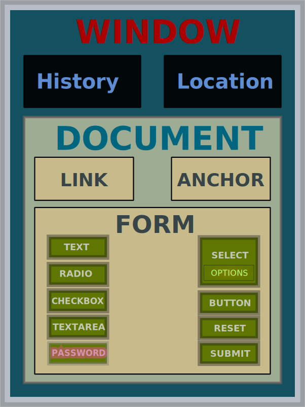

title: JavaScript and JIT Compilation
output: JavaScript-and-JIT-Comilation.html

---

# JS and JIT

## TEAM #14

## B10315002 黃昱豪
## B10315005 林昆立
## B10315024 朱伯軒

---

### JavaScript

- 1995 年，由 *Netscape* 公司發明
- 三大元素組成：*ECMAScript*, *BOM*, *DOM*
- 過去屬於 *直譯語言* [1] ，但是某些實作版本 (Node.js, 源自於 V8-engine) 採用 *即時編譯技術*
- 最常見於瀏覽器

    [1]: 直譯語言：不需經過編譯，由直譯器直接翻譯程式碼來運作的程式語言

---

### JavaScript 語言的特性

- 動態型別
- 所有東西都是 *物件*
- 最常用的 pattern -- *Event Driven*

---

### Just-In-Time Compiliation

- 執行時進行編譯的動作
- 跨架構模擬器 (cross architecture emulator)
	- 模擬一個CPU：Visual Boy Advance
	- 指令的轉譯：QEMU
- QEMU -- 可以在 x86 architecture 下執行 ARM 架構的 Android

---

# 前端？後端？

---

# 既可前端也可後端

---

# 巫術
##~~JS 統治世界啦~~

---

# 在前端你有...

---

### 大量的函式庫

- jQuery
- Angular
- Reack.js
- ExtJS
- BackboneJS
- EmberJS
- KnockoutJS

---

#何謂DOM

---

---

### jQuery

- javascript 函數庫
- 很輕很小 (32KB)
- 功能豐富
- 直接操作DOM

----

### Angular

- Google 大力發展
- 有類似 MVC 模式的邏輯
- 雙向資料繫結

---

### three.js

- 簡化使用 WebGL 的複雜度
- 各種基於 three.js 的小東西
    - voxel.js
    - cubeslam
    - Physijs

---

# 在後端你有...

---

### Node.js

- 約 2009 年開始發展，把 Chrome 瀏覽器的 JavaScript 引擎（V8-engine）移植出來成為獨立執行的 JavaScript 執行環境
- JavaScript 達成 Full-Stack
  （Front-End 前端：瀏覽器裡面 / Back-End 後端：伺服器上面）
- Event-driven 的特性，讓以前難以實作（成本過高）的事情變得可能
	- 即時聊天室
	- HTML5 Online Game
- non-block IO

---

# Demo

---

### References

- images/DOM.svg from [Wikipeida:JKDOM.SVG](http://en.wikipedia.org/wiki/Document_Object_Model#mediaviewer/File:JKDOM.SVG)
